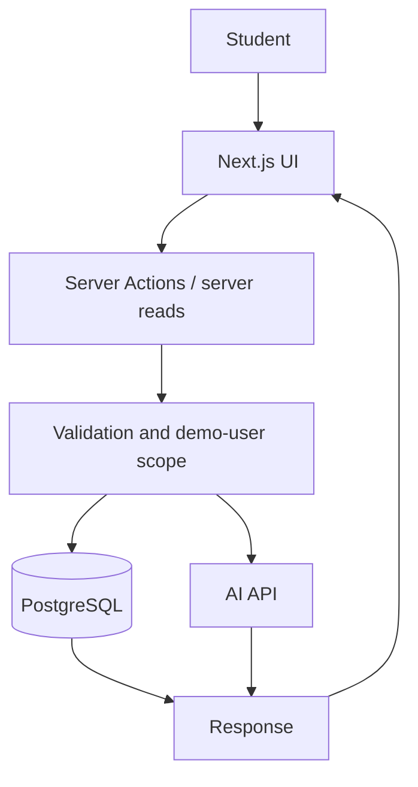
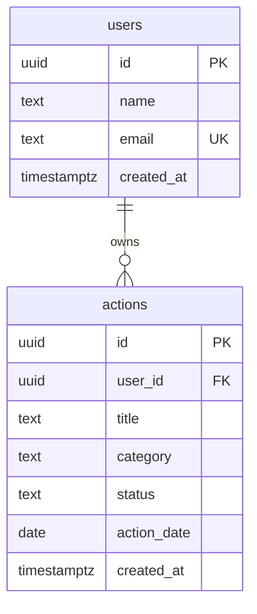

# Technical Design

Status: spesifikasi implementasi MVP; dokumen ini tidak berisi implementation code. Detail asumsi mengikuti PRD A1–A8.

## 1. Architecture Overview

Full-stack monolith: Next.js + JavaScript, Tailwind CSS + shadcn/ui, Supabase (PostgreSQL), dan satu AI API. UI, server logic, query database, dan integrasi AI berada pada satu aplikasi.



Tidak ada backend service terpisah, repository layer, Redis, WebSocket, queue, atau framework agent. Pembacaan dilakukan server-side; interaksi mutasi melalui Server Actions.

## 2. System Flow

### Recommendation

Buka dashboard → baca user dan aksi hari ini → jika kosong tampilkan CTA → minta tiga rekomendasi AI → validasi atau gunakan fallback → transaction simpan batch → tampilkan aksi tersimpan.

### Tracking

Klik selesai → disable baris yang pending → validasi ID/user/tanggal → update todo menjadi completed → baca ulang dashboard/history → tampilkan sukses. Tidak ada optimistic success sebelum database mengonfirmasi.

### Progress and feedback

Baca agregasi database → tampilkan progress → user meminta feedback → server membaca ulang ringkasan → AI menghasilkan pesan → tampilkan bersama snapshot. Completion berikutnya membatalkan tampilan feedback lama dan menawarkan pembaruan.

## 3. Project Structure

Struktur berikut adalah rekomendasi untuk tahap coding; belum dibuat dalam pekerjaan dokumentasi ini.

```text
app/
  layout.js
  page.js
  history/page.js
  actions.js
  loading.js
  error.js
  globals.css
components/
  daily-actions.js
  progress-summary.js
  feedback-panel.js
  ui/                    # hanya komponen shadcn yang digunakan
lib/
  db.js                  # koneksi; query langsung pada server logic
  ai.js                  # pemanggilan provider dan validasi output
  date.js                # kalender Asia/Jakarta
db/
  migrations/
  seed.js
docs/
AGENTS.md
.env.example
```

Server read helpers dapat berada di app/actions.js atau modul server terdekat; jangan mengekspor helper privat sebagai action publik. Jangan menambah layer agar mengikuti diagram folder semata.

## 4. UI/UX Reference Analysis — Mobbin

Prinsip: **Reference by UX problem, not by visual similarity.**

Pemeriksaan 24 September 2026: [katalog web Mobbin](https://mobbin.com/discover/apps/web) dapat dibuka, tetapi hasil pembacaan tidak menampilkan screen/flow produk yang dapat diperiksa. User belum memberikan screenshot atau tautan screen. Karena itu, tidak ada analisis screen Mobbin terverifikasi yang diklaim dalam dokumen ini.

Dua slot berikut adalah kebutuhan referensi yang belum terpenuhi, bukan referensi produk yang telah ditemukan.

### Reference 1 — Pending: daily task completion

- **Product:** belum diverifikasi.
- **Relevant Screen / Flow:** daftar aktivitas hari ini → completion → status selesai.
- **UX Problem Solved:** user perlu memilih aksi dan langsung mengetahui hasil pencatatan.
- **Pattern Worth Learning:** hierarchy judul/status, penempatan action per baris, pending/error pada item.
- **Why It Works:** hipotesis desain lokal: daftar singkat mengurangi beban pemindaian; belum merupakan temuan dari Mobbin.
- **What We Will Adapt:** baseline sementara berupa daftar tiga aksi dengan completion inline.
- **What We Will NOT Copy:** identitas visual, warna, logo, ilustrasi, atau layout presisi produk lain.

### Reference 2 — Pending: weekly activity review

- **Product:** belum diverifikasi.
- **Relevant Screen / Flow:** ringkasan minggu → rincian aktivitas.
- **UX Problem Solved:** user perlu memahami konsistensi tanpa dashboard analitik yang rumit.
- **Pattern Worth Learning:** summary-first, pengelompokan per tanggal, zero state, informasi sekunder.
- **Why It Works:** hipotesis desain lokal: ringkasan dan rincian berurutan menghubungkan angka dengan aktivitas; belum merupakan temuan dari Mobbin.
- **What We Will Adapt:** baseline sementara berupa ringkasan teks dan riwayat per tanggal.
- **What We Will NOT Copy:** chart dekoratif, gamification, brand, dan gaya ilustrasi.

Jika referensi tersedia, isi kedua slot dengan nama produk, URL screen, observasi nyata, dan alasan adaptasi. Gunakan 2–4 screen relevan saja. Kekurangan referensi tidak menghalangi core implementation; jangan mengganti status pending dengan klaim rekaan.

## 5. UI/UX Direction

Baseline sementara berasal dari brief user, bukan observasi Mobbin: restrained, clean utilitarian, palet netral dengan satu accent hijau, border tipis, shadow minimal, radius terkendali, dan typography jelas.

Gunakan daftar dan section terbuka. Hindari oversized hero, glassmorphism, gradient dekoratif, banyak cards, badges warna acak, fake metrics, chart tanpa tujuan, serta animasi berlebihan. Bahasa ramah dan konkret; tidak menyalahkan user yang belum beraksi.

## 6. Information Hierarchy

| Pertanyaan | Dashboard / | History /history |
| --- | --- | --- |
| Pertama dilihat | Aksi hari ini dan selesai/total | Rentang minggu dan selesai/total |
| Primary action | Saat kosong: dapatkan aksi; setelah tersedia: selesaikan aksi | Membaca progress; tidak perlu CTA besar |
| Informasi sekunder | Total sepanjang waktu, feedback | Distribusi kategori dan rincian |
| Contextual action | Selesaikan per item; coba lagi; minta feedback | Coba lagi saat gagal; kembali ke hari ini saat kosong |
| Grouping | Tanggal, daftar aksi, feedback | Summary, hitungan harian, kategori, riwayat per tanggal |
| Tanpa card | Navigasi, judul, metrik teks, daftar | Heading tanggal, kategori, baris aktivitas |
| Progressive disclosure | Feedback baru muncul saat diminta | Rincian diletakkan setelah summary; tanpa accordion wajib |

Dahulukan typography, spacing, alignment, dan contrast. Satu tujuan utama per state; tidak menjadikan setiap item sebagai primary CTA berwarna.

## 7. Pages / Screens

### Dashboard — /

- **Purpose:** mengetahui, menjalankan, dan mencatat aksi hari ini.
- **User:** pelajar; implementasi demo memakai seeded user.
- **Mobbin Reference:** Reference 1 pending, belum ada screen terverifikasi.
- **Reference Pattern Used:** baseline lokal: daftar aktivitas dan feedback inline.
- **Primary Information:** tanggal, selesai/total, tiga judul aksi dan kategori.
- **Primary Action:** dapatkan aksi saat kosong; selesaikan item todo setelah batch tersedia.
- **Secondary Actions:** history, minta/perbarui feedback.
- **Content Structure:** navigasi → judul/tanggal → ringkasan hari ini → daftar/empty CTA → total sepanjang waktu → feedback singkat.
- **Important States:** loading skeleton; empty CTA; error inline dan retry; success status completed; disabled saat pending/selesai; validation error terkait item.
- **Responsive Behavior:** satu kolom, judul membungkus, tombol completion mudah disentuh; ringkasan tetap di atas daftar.

### History — /history

- **Purpose:** memahami konsistensi minggu berjalan.
- **User:** sama dengan dashboard.
- **Mobbin Reference:** Reference 2 pending, belum ada screen terverifikasi.
- **Reference Pattern Used:** baseline lokal: summary-first dan daftar per tanggal.
- **Primary Information:** tanggal minggu, selesai/total dan jumlah selesai harian.
- **Primary Action:** membaca ringkasan; ketika kosong, kembali ke dashboard.
- **Secondary Actions:** navigasi hari ini; retry pembacaan.
- **Content Structure:** navigasi → heading/rentang minggu → summary → tujuh hitungan harian → empat kategori → daftar aksi per tanggal.
- **Important States:** loading placeholder; empty dengan alasan/next step; error retry; success data tersimpan; disabled retry ketika pending; validation tidak membutuhkan form karena tidak ada input tanggal.
- **Responsive Behavior:** hitungan harian menjadi daftar vertikal bila ruang sempit, riwayat tetap list; tanpa table horizontal.
- Riwayat minggu sebelumnya, pagination, pencarian, dan filter berada di luar MVP.

## 8. Components

| Component | Purpose / reuse | Data | Interaction | States |
| --- | --- | --- | --- | --- |
| DailyActions | daftar dan baris aksi; dashboard-specific | action DTO, today | generate, complete | loading, empty, pending, completed, error |
| ProgressSummary | ringkasan; dipakai dua halaman | progress DTO | tidak perlu interaksi | loading, zero, ready, error |
| FeedbackPanel | feedback; dashboard-specific | message, source, snapshot | minta/perbarui | idle, pending, ready, stale, fallback, error |
| Navigation | perpindahan dua halaman; reusable | path aktif | navigasi | active, focus |
| History section | rincian; cukup inline di halaman | weekActions | baca | empty, ready |

Gunakan Button dan komponen dasar shadcn seperlunya. Jangan membuat ButtonWrapper, TextWrapper, CardWrapper, atau memecah setiap label menjadi component.

## 9. Design System

### Typography

System sans-serif; empat tingkat: page title 24/32 px semibold, section title 18/26 px semibold, body 16/24 px, caption/muted 14/20 px. Muted adalah role warna, bukan tingkat ukuran kelima.

### Spacing

Scale 4, 8, 12, 16, 24, 32, 48 px. Gap item 12–16; antar-section 24–32; margin mobile 16. Touch target sekurangnya 44 px sebagai target desain.

### Color Roles

| Role | Baseline |
| --- | --- |
| background | #FAFAFA |
| surface | #FFFFFF |
| foreground | #171717 |
| muted | #525252 |
| border | #D4D4D4 |
| primary | #166534 |
| success | #166534 + teks status |
| warning | #92400E + teks |
| destructive | #B91C1C + teks |

Warna kandidat harus diperiksa kontrasnya saat implementasi. Kategori menggunakan label teks netral.

### Radius

Input/button 6 px; container yang memang perlu 8 px; modal jika kelak diperlukan maksimal 12 px. MVP tidak membutuhkan modal.

### Elevation

Default tanpa shadow; gunakan border dan whitespace. Shadow hanya untuk elemen overlay yang benar-benar ada.

## 10. Responsive Strategy

| Page | Desktop ≥1024 px | Tablet 768–1023 px | Mobile <768 px |
| --- | --- | --- | --- |
| Dashboard | konten satu kolom, max-width 880 px; summary inline | padding 24 px; item tetap list | padding 16 px; summary wrap, kontrol item di bawah judul bila perlu |
| History | tujuh hitungan harian berjajar, rincian full-width | hitungan wrap sesuai ruang | hitungan harian list; kategori teks; rincian per tanggal |

Navigasi hanya dua tautan sehingga tidak perlu hamburger/sidebar. Pertahankan urutan baca dan primary action. Tidak ada table atau chart yang memerlukan scroll horizontal.

## 11. UX States

- **Loading:** heading/navigasi tetap; skeleton untuk data; spinner berlabel pada tombol. Jangan tampilkan angka nol seolah sudah terbaca.
- **Empty:** bedakan belum ada rekomendasi, belum ada completion, dan tidak ada aktivitas minggu ini; arahkan ke dapatkan/selesaikan aksi.
- **Error:** pesan dekat interaksi, data sukses sebelumnya tetap terlihat, retry eksplisit.
- **Success:** ubah status inline dan ringkasan; gunakan pengumuman aksesibel, tanpa toast wajib atau redirect.
- **Disabled:** tombol generation selama pending; completion selama pending dan setelah completed. Alasan tetap jelas.
- **Validation:** ID dan output AI diperiksa server. Tidak ada form user di MVP; error action ditampilkan pada daftar/panel terkait.
- **Stale:** setelah completion, feedback lama disembunyikan atau diberi label belum diperbarui; response lama yang datang terlambat tidak boleh dianggap terbaru.
- **Destructive Action:** tidak ada delete, reset, atau undo pada UI MVP; tidak perlu confirmation modal.
- **Day changed:** tampilkan bahwa hari telah berganti dan muat ulang aksi hari ini.

## 12. Data Model

### users

| Field | Conceptual datatype | Required | Constraint |
| --- | --- | --- | --- |
| id | UUID | ya | primary key |
| name | text | ya | nama demo nonkosong |
| email | text | ya | unique; email sintetis demo |
| created_at | timestamptz | ya | default waktu server |

### actions

| Field | Conceptual datatype | Required | Constraint |
| --- | --- | --- | --- |
| id | UUID | ya | primary key |
| user_id | UUID | ya | FK users.id |
| title | varchar(160) | ya | trim, nonkosong |
| category | text | ya | energy / waste / transport / food |
| status | text | ya | todo / completed; default todo |
| action_date | date | ya | tanggal kalender Asia/Jakarta dari server |
| created_at | timestamptz | ya | default waktu server |



Index (user_id, action_date). Unique (user_id, action_date, title) menjadi backstop duplikasi judul, bukan satu-satunya proteksi batch. Tidak ada entity feedback atau daily batch.

**Atomic daily generation:** AI dipanggil di luar transaction. Setelah output siap, transaction mengunci row user, mengecek ulang aksi tanggal target, lalu mengembalikan batch existing atau menyimpan tepat tiga row sekaligus. Semua jalur generation termasuk fallback memakai prosedur ini. Jangan menahan lock selama request AI.

Jika tanggal berubah sebelum penyimpanan, batalkan dengan DAY_CHANGED dan muat ulang; jangan menyimpan batch pada tanggal baru secara diam-diam. Batch existing harus tiga row; data parsial merupakan DATA_INTEGRITY, bukan alasan append otomatis.

Completion hanya hari ini, idempotent; tidak ada completed_at. Karena itu hitungan harian mengacu pada action_date, bukan timestamp completion.

**Progress semantics:**
- today: completed/total pada tanggal hari ini.
- allTimeCompleted: semua row completed milik user.
- week: Senin sampai Minggu yang mencakup today.
- weeklyTotal: semua aksi minggu ini sampai today; weeklyCompleted: subset completed.
- completionRate: weeklyCompleted / weeklyTotal × 100, dibulatkan; null jika total 0.
- byDay: tujuh tanggal dengan total/completed; tanggal masa depan ditandai isFuture dan ditampilkan “—”.
- byCategory: jumlah completed minggu ini untuk keempat kategori, termasuk nol.
- weekActions: aksi minggu ini sampai today, urutan tanggal menurun lalu created_at/id stabil.
- Tidak ada streak, target 21 aksi, atau persentase pengurangan emisi.

## 13. Data Flow

- **Generate:** CTA → server menentukan user/today → baca existing → AI/fallback → validasi → lock/recheck/atomic insert → DTO tersimpan → refresh dashboard dan history.
- **Complete:** actionId → validasi → query scoped user → pastikan tanggal hari ini → conditional update → success idempotent → refresh kedua halaman.
- **Progress:** server scoped queries → agregasi dari snapshot database konsisten → DTO angka dan history → UI.
- **Feedback:** request tanpa statistik client → baca progress server → snapshotKey → AI/fallback → message + source + snapshotKey → UI hanya menerima response jika snapshot masih sesuai data aktif.

snapshotKey adalah fingerprint deterministik tanggal dan ID/status aksi dalam konteks feedback. Bukan entity/cache baru; tidak disimpan. Pergantian hari atau perubahan data membatalkan hasil lama.

## 14. API / Server Actions / Backend Interface

Kontrak lengkap ada di [api.md](api.md); tidak membuat REST API paralel.

| Operation | Purpose | Input / validation | Output | Possible errors | Related UI |
| --- | --- | --- | --- | --- | --- |
| generateDailyActions | satu batch hari ini | tanpa input; user/tanggal server | actions, source, notice | DB_UNAVAILABLE, DAY_CHANGED, DATA_INTEGRITY | dashboard |
| getTodayActions | baca batch hari ini | tanpa input | today, actions | DB_UNAVAILABLE, DATA_INTEGRITY | dashboard |
| completeAction | selesaikan aksi | actionId UUID; owner/tanggal | action | INVALID_INPUT, NOT_FOUND, ACTION_EXPIRED, DB_UNAVAILABLE | dashboard |
| getProgress | agregasi + riwayat minggu ini | tanpa input | progress DTO, snapshotKey | DB_UNAVAILABLE | keduanya |
| generateFeedback | feedback dari data aktual | tanpa input; context server | message, source, snapshotKey | DB_UNAVAILABLE | dashboard |

Authentication semua operasi: tidak ada login dalam demo; user aktif ditetapkan server. DEMO_USER_MISSING dapat terjadi pada semua operasi. Ini bukan autentikasi personal.

## 15. Authentication & Authorization

**Authentication is outside the MVP scope.**

ASSUMPTION: satu seeded demo user; ID ditentukan server, bukan parameter client. Semua query dan update tetap dibatasi user_id aktif. ID aksi milik user lain dikembalikan NOT_FOUND agar tidak membocorkan keberadaannya.

Semua pengunjung demo berbagi identitas dan data; tidak ada isolasi antar-pengunjung. Gunakan data sintetis dan akses demo terkendali. Login personal atau peluncuran publik multiuser membutuhkan keputusan scope terpisah sebelum release tersebut.

## 16. AI Integration

- **Input:** tanggal, empat kategori yang diperbolehkan, konteks pelajar, judul aktivitas tujuh hari terakhir, dan agregasi completion.
- **Context:** aktivitas sederhana dan murah, bahasa Indonesia, tanpa data nama/email, lokasi detail, atau chat bebas.
- **Model Responsibility:** mengusulkan aksi dan merumuskan feedback; bukan menghitung progress atau mengubah database.
- **Output:** rekomendasi terstruktur tepat tiga objek title/category; feedback teks 1–3 kalimat, maksimum 500 karakter.
- **Action 1:** aplikasi memvalidasi rekomendasi dan menyimpan batch secara atomik.
- **Action 2:** aplikasi menyajikan feedback berdasarkan agregasi server; completion tetap tindakan user.
- **Fallback:** tiga aksi kurasi, misalnya memakai botol minum yang sudah dimiliki, mematikan lampu yang tidak digunakan bila aman, dan mengambil porsi makan secukupnya. Feedback aturan menggunakan angka database dan satu saran; tampilkan label cadangan.
- **Failure State:** Maksimal tiga percobaan total (termasuk request awal dan satu model cadangan Gemini), seluruhnya dalam deadline 10 detik. Retry hanya kegagalan sementara (network/429/5xx) dengan jeda singkat; hormati Retry-After bila masih muat dalam deadline. Error permanen tidak diulang pada model yang sama; bila waktu habis, key/model tidak tersedia, atau output tidak valid, langsung gunakan fallback tervalidasi berlabel. Tidak ada retry background atau retry berulang pada refresh.
- **Limitations:** rekomendasi tidak menjamin cocok untuk setiap kondisi; tidak membuat klaim presisi emisi, saran berbahaya, menyalahkan, atau pembelian wajib. Output tidak aman yang terdeteksi ditolak.
- **Provider:** Google Gemini API sebagai enhancement, dengan AI_MODEL dan AI_FALLBACK_MODEL (opsional) dari provider yang sama. Verifikasi model tidak memblokir core; konfigurasi kosong langsung memakai fallback. Gunakan pemanggilan sederhana, tanpa router/framework tambahan.
- Render sebagai teks, bukan HTML. Validasi panjang, jumlah, kategori, duplikasi judul, dan tinjau kelayakan prompt/output dengan contoh.
- source untuk hasil generation: ai, fallback, atau existing. Provenance tidak disimpan; pada refresh sebut “Aksi harian”, jangan mengklaim batch existing pasti dibuat AI.
- Tidak ada requirement AI agent; ini personal assistant yang terintegrasi workflow, bukan chatbot.

## 17. Error Handling

| Error | User Message | Recovery Action | Technical Handling |
| --- | --- | --- | --- |
| Network failure | Koneksi terputus. Coba lagi. | retry | pertahankan data lama; mutation idempotent |
| Invalid input | Aksi tidak valid. | refresh daftar | validasi UUID/allowlist; INVALID_INPUT |
| Unauthorized | Sesi tidak tersedia. | kembali/muat ulang jika auth kelak ada | tidak digunakan pada mode demo; jangan pura-pura memiliki sesi personal |
| Forbidden | Aksi tidak tersedia. | refresh | owner mismatch dimask sebagai NOT_FOUND |
| Not found | Aksi tidak ditemukan. | refresh | NOT_FOUND tanpa membocorkan owner |
| Database failure | Data belum dapat dimuat/disimpan. | retry | rollback, DB_UNAVAILABLE; tanpa sukses palsu |
| External API failure | Layanan AI belum tersedia; memakai cadangan. | lanjutkan flow | timeout terikat; fallback |
| AI invalid/failure | Rekomendasi/feedback cadangan digunakan. | lanjutkan flow | validasi output; jangan simpan output invalid |
| Day changed / expired | Hari telah berganti atau aksi sudah lewat. | muat hari ini | DAY_CHANGED / ACTION_EXPIRED |
| Demo config / partial batch | Demo belum siap. | tim memperbaiki konfigurasi/data | DEMO_USER_MISSING / DATA_INTEGRITY; log aman |

AI failure tidak boleh membatalkan completion. Jika database gagal, fallback AI tidak boleh menutupi kegagalan penyimpanan.

## 18. Security Basics

Secrets dan query hanya server-side. Konfigurasi database/provider melalui environment variables, tidak memakai prefix publik. Validasi input dan output AI; jangan percaya user_id, tanggal, status, atau statistik dari client.

Gunakan SQL parameterized dengan driver PostgreSQL; enforcement FK/check/unique di database. Semua pembacaan dan perubahan scoped user. Batasi output AI dan timeout. Log kode error/konteks teknis minimum tanpa key, connection string, atau data pribadi.

Generation existing tidak memanggil AI lagi; feedback dipicu manual dan tombol pending mencegah klik biasa berulang. Ini bukan rate limit terhadap penyalahgunaan. Tidak menambah infrastruktur rate limit untuk demo terkendali; exposure publik memerlukan evaluasi quota/access terlebih dahulu.

## 19. Deployment Architecture

- **Application Hosting:** Vercel, sesuai pilihan user. Akses project dan jalur koneksi PostgreSQL untuk deployment belum diverifikasi.
- **Database:** Supabase hosted PostgreSQL, menggantikan Docker sesuai pilihan terbaru user. Akses melalui satu driver PostgreSQL di server, SQL parameterized, dan DATABASE_URL. Runtime Vercel memakai transaction pooler; gunakan satu koneksi yang sama sepanjang transaction dan hindari named prepared statements. Migration memakai direct connection atau session pooler sesuai konektivitas, melalui MIGRATION_DATABASE_URL. TLS memakai CA prod-ca-2021.crt dari user dengan rejectUnauthorized: true; SELECT 1 melalui DATABASE_URL sudah berhasil. Driver harus membaca CA secara eksplisit; parameter SSL pada connection string tidak boleh menimpa konfigurasi CA. Sertakan file CA saat deployment dan verifikasi koneksi dari Vercel. Lihat Decision 011 dan hasil verifikasi CA di decisions.md.
- **External Services:** satu AI provider; tanpa OAuth/storage tambahan.
- **Environment Variables:** DATABASE_URL, MIGRATION_DATABASE_URL (untuk migration), AI_API_KEY, AI_MODEL, AI_FALLBACK_MODEL (opsional), DEMO_USER_ID. APP_TIMEZONE dapat dikonfigurasi tetapi nilainya dikunci Asia/Jakarta untuk MVP.
- Flow: browser → Next.js → Server Action/server read → PostgreSQL / AI → UI.
- Phase 0 memeriksa akun/credentials dan kelayakan deployment; Phase 6 migration, seed sintetis, build/deploy, dan smoke test.
- Jalankan migration/seed secara terkendali; jangan otomatis menjalankan seed pada setiap request.
- Tidak mengunci versi dependency yang belum diverifikasi; pin versi kompatibel pada setup dan pertahankan lockfile.

## 20. Technical Trade-offs

### Monolith and Server Actions

**Decision:** UI dan server logic dalam Next.js; query langsung.
**Reason:** mengurangi integrasi dan waktu implementasi.
**Trade-off:** interface backend terikat aplikasi.

### Demo identity

**Decision:** satu seeded user tanpa login.
**Reason:** auth tidak ditetapkan sebagai core requirement.
**Trade-off:** hanya demo bersama; bukan privasi/isolation multiuser.

### Minimal persistence

**Decision:** dua entity, feedback ephemeral, tanpa completed_at.
**Reason:** cukup untuk core workflow.
**Trade-off:** history berdasarkan tanggal aksi; tidak ada audit waktu completion atau provenance AI persisten.

### One daily batch

**Decision:** tiga aksi immutable per tanggal, transaction lock pada user.
**Reason:** retry dan concurrency tidak mengubah rekomendasi atau progress.
**Trade-off:** tanpa regenerasi/aksi kustom; dua request serentak masih bisa memanggil AI sebelum salah satunya memakai existing batch.

## 21. Design Trade-offs

### List instead of separate cards

**Reference:** slot Reference 1 pending; baseline dari brief.
**Decision:** tiga baris aksi dengan completion inline.
**Reason:** user perlu memindai dan menyelesaikan aksi dengan cepat.
**Trade-off:** lebih sedikit ekspresi visual per aksi.

### Counts instead of charts

**Reference:** slot Reference 2 pending; baseline dari brief.
**Decision:** angka harian, kategori, dan riwayat teks.
**Reason:** data kecil dan user membutuhkan progress konkret.
**Trade-off:** tidak menyediakan eksplorasi tren panjang.

### Manual feedback

**Reference:** tidak ada referensi terverifikasi.
**Decision:** feedback diminta melalui tombol.
**Reason:** mengendalikan latency dan pemakaian AI.
**Trade-off:** satu interaksi tambahan; feedback harus diminta ulang setelah completion.

## 22. Final Design Principles

1. Core action selalu jelas dan didahulukan.
2. Gunakan spacing dan typography sebelum menambah card.
3. Satu tujuan utama per state; action item tetap contextual.
4. Mobile mempertahankan hierarchy dan target sentuh.
5. Referensi Mobbin adalah inspirasi pola; jangan mengarang observasi atau menyalin pixel.
6. Functional states lebih penting daripada dekorasi.
7. Angka berasal dari database; AI hanya membantu rekomendasi dan bahasa feedback.
8. Jangan menambahkan UI, layanan, atau abstraction di luar PRD.

### Detail persistence terverifikasi (T02)

Driver pg, lib/db.js server-only dan lib/db-config.mjs untuk konfigurasi TLS bersama script CLI. db/migrate.mjs menerapkan SQL versioned dengan advisory lock dan ledger ecoaction_migrations; ledger hanya metadata operasional. db/seed.mjs memakai DEMO_USER_ID sintetis dan bersifat idempotent. RLS users/actions aktif tanpa policy publik, privilege anon/authenticated dicabut. db/verify.mjs memeriksa constraint/read-write dengan fixture rollback.
